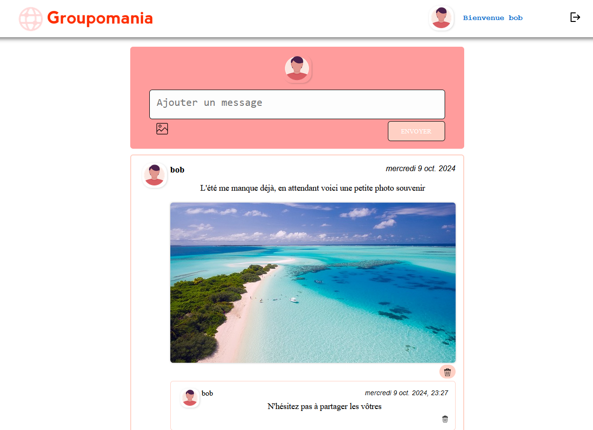

# GROUPOMANIA

## Projet 7 du parcours Développeur Web d'Openclassrooms.

Le client Groupomania est un groupe spécialisé dans la grande distribution et souhaite construire un réseau social interne pour les employés de l'entreprise afin de faciliter les interactions entre collègues.



## Fonctionnalités implémentées

- Création d'utilisateurs (CRUD)
- Les utilisateurs pourront
  - Voir les derniers posts
  - Publier des images
  - Publier du texte
  - Modifier leur profil
- Sur chaque posts, les utilisateurs pourront
  - Commenter
  - Supprimer leur propre post/commentaire
- Modération par des administrateurs qui peuvent
  - Supprimer les posts/commentaires qu'ils jugent inappropriés.
- Session persistante au rechargement de la page

## Technologies utilisées

- Backend
  - Serveur **Node.js** avec Framework **Express**
  - Base de Données **MySQL**
  - **API REST**
- Frontend
  - Framework **React**
  - **SASS**
- Sécurité
  - Bcrypt
  - DotEnv
  - Email-validator
  - Password-validator
  - Helmet
  - JWT

## Objectifs

- Gérer le backend en MVP de l'application en créant une API avec javascript.
- Utiliser une base de donnée avec mySQL pour enregistrer les utilisateurs, leurs posts et leurs commentaires.
- Sécuriser l'API.
- Mettre en œuvre des opérations CRUD de manière sécurisée.
- Mettre en place le frontend avec le framework React.

## Installation

### **Préparer la base de données MySQL**

- Se connecter à MySQL depuis l'invite de commande :

```bash
mysql -u root -p
```

- Une fois dans MySQL, créer une nouvelle base de donnée avec le nom souhaité

```sql
CREATE DATABASE Groupomania CHARACTER SET 'utf8';
```

- Ajouter les tables à la nouvelle base grâce au fichier **groupomania.sql**

```sql
SOURCE database/groupomania.sql
```

- Quitter MySQL puis dans l'invite de commande, taper ceci en remplaçant le chemin d'accés vers le fichier .sql

```bash
mysql -u root -p groupomania < /chemin/vers/fichier/groupomania.sql
```

- Retourner dans MySQL et selectionnez votre base de donnée

```bash
Use groupomania;
```

### Backend

- Ajouter le fichier .env dans le dossier ./back/, avec les variables :

```
PORT=5000
JWT_TOKEN=a0e141b8-e49c-43af-87fb-28542d6d83ff
```

- Initialisation et démarrage du backend

```bash
cd back
npm install
node server
```

### Frontend

- Ouvrir un nouveau terminal
- Initialisation et démarrage du frontend (React doit être installé sur la machine)

```bash
cd front
npm install
yarn start # (ou npm start) Lancer le frontend
```
